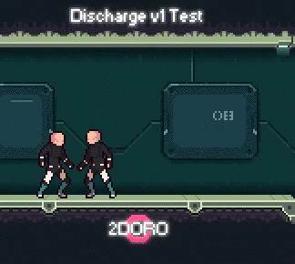
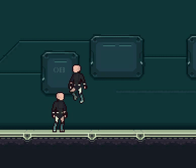

# 2D Multiplayer Platformer

2 DORO is a multiplayer platformer built using Unity and GameSparks. It features up to 4 player PvP combat with seperate rooms and levels for each match.

## Screenshots from actual gameplay during a PvP fight

## Contributions
---
Development for this project has stopped.
